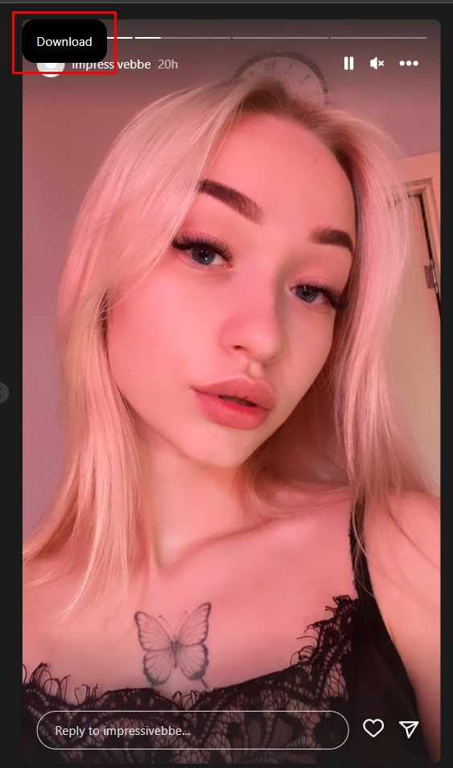
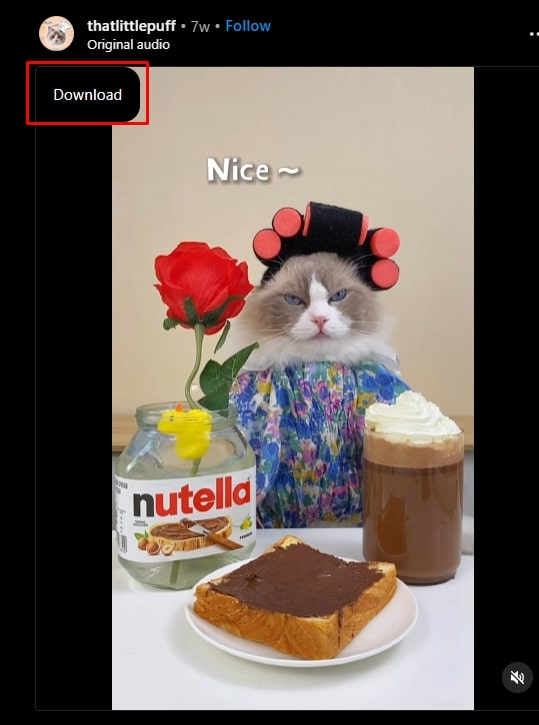
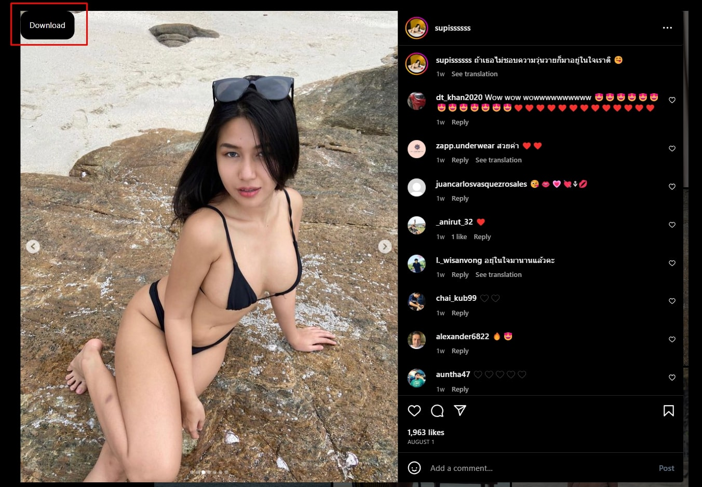

# DowInsta


### Description

Supports downloading of videos and images. Download Posts, Stories, Highlits, Reels, TV from Instagram in high resolution. 

### Features

- Download images ✅
- Download videos ✅
- Download posts photos ✅
- Download posts videos ✅
- Download stories' photos ✅
- Download stories' videos ✅
- Download highlits photos ✅
- Download highlits videos 🚫 (use [this service](https://saveinsta.app/ru/download-video-instagram) instead)
- Download Reels ✅
- Download TVs ✅

### Install

1. Download [latest version](https://github.com/serpo-dev/dowinsta/releases) or clone this repo from the command:

```
git clone https://github.com/serpo-dev/dowinsta
```

2. Enable extensions developer mode in your browser (Extensions -> Manage Extensions -> Developer Mode "ON").

3. Click on "Load unpacked" button and choose the extracted folder from the downloaded file.

### Usage

- Click on black "Download" button.
- Wait until download starts. 
- The download my take a few seconds to begin ⏳ (especially if the video file is large).

### Demo





### Compatibility

- Google Chrome
- FireFox
- YandexBrowser
- Microsoft Edge